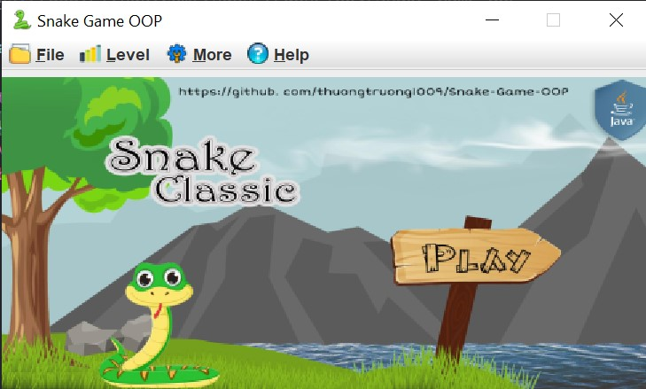
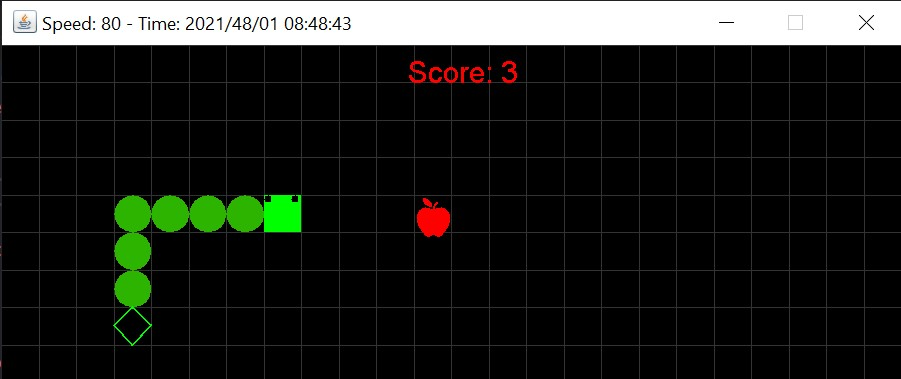
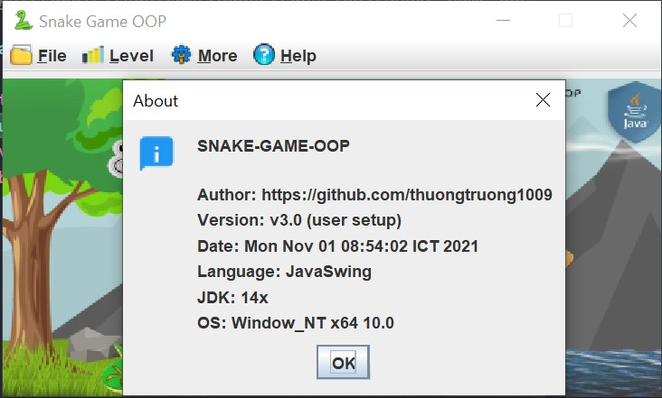
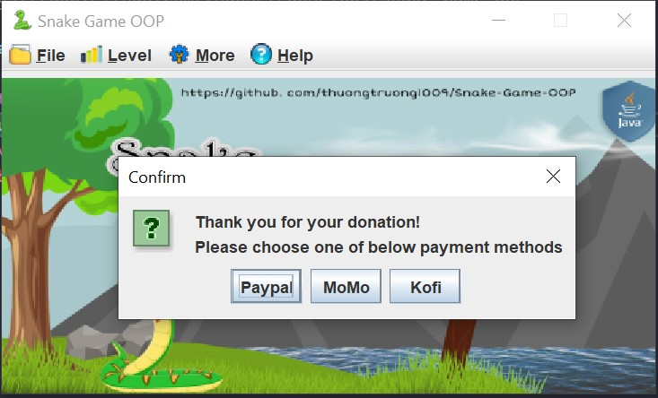
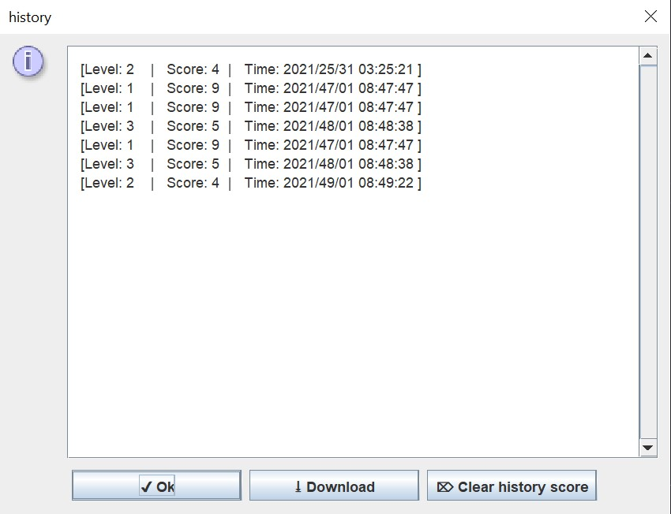
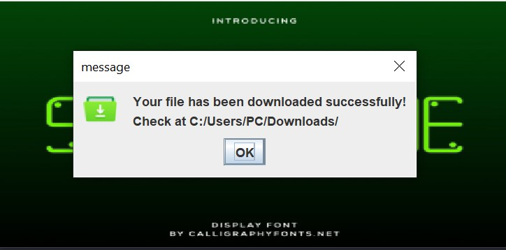
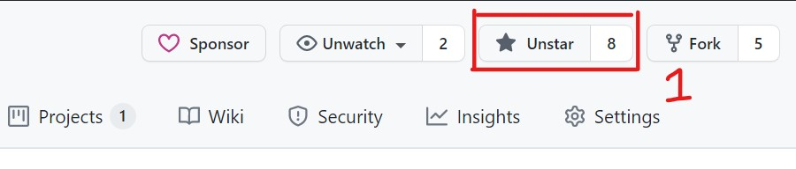
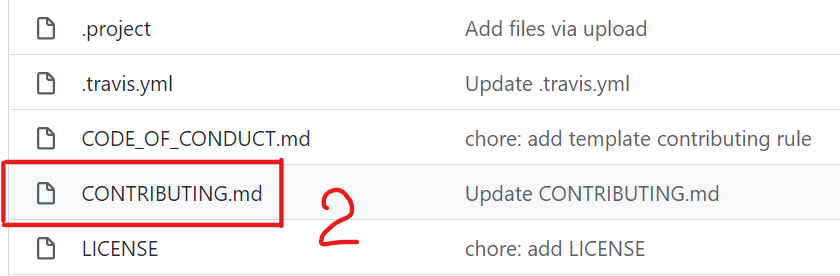
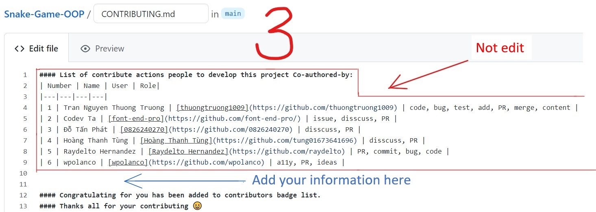

<!-- ALL-CONTRIBUTORS-BADGE:START - Do not remove or modify this section -->
[](#contributors-)
<!-- ALL-CONTRIBUTORS-BADGE:END -->

[](https://circleci.com/gh/circleci/circleci-docs)
[](https://app.codacy.com/gh/thuongtruong1009/Snake-Game-OOP?utm_source=github.com&utm_medium=referral&utm_content=thuongtruong1009/Snake-Game-OOP&utm_campaign=Badge_Grade_Settings)

[](https://www.codefactor.io/repository/github/thuongtruong1009/snake-game-oop)


<div align="center" display="flex">
  <h1>SNAKE GAME OOP </h1>
  
</div>

## 🎴 What's the snake game
* Snake is a game in which the players need to think about controlling snake to explore an map and catch the appples and handle the situation to avoid hitting with the any obstacle or itself. They will compete against each other with points and time after each match.

## 📌 First require
+ The final project on labory in my school. It request is use any language programming to make a game or application. My team have 2 student and we try hard to complete them in 3 week.
+ Make report speech format in docx or pdf.
+ Have PowperPoint presentation slides.
+ Show detail diagram of project structure.
+ I sometimes make refer on the internet but they seem like very difficult.
+ Now, i am enhancing update code for better. Let wait...

## 🎨 We used
+ Java Core 8 and Java Swing basic.
+ Buffer, Builder and Socket I/O in Java API.
+ Function, loop, algorithms, implement, extend, Thread in Java.
+ UML diagram in programming.
+ Design pattern (although it hasn't really been applied completely, but overall I'm trying to make it happen).
+ Refferent on StackOverflow and Youtube BroCode chanel.
+ Thank you [@TP-O](https://github.com/TP-O) supported us in this project.

## 🚀 Some of our core summaries
+ Explore and learn how the Java language works through libraries and methods.
+ Familiarize yourself with object oriented programming and its working principle.
+ Introduce the Java Swing and java.awt libraries through implementation and method inheritance its.
+ An overview of Design patterns and their operation diagrams.
+ Using the UML diagram to analys codes and information processing.
+ Understand how multithreading works and manage it.
+ Take advantage of the I/O mechanism to download files to local and open URL on broswer.
+ Learn about system manipulation with Buffer and Builder in Java.
+ Get familiar with Socket I/O by displaying source device address information.
+ Manipulating arrays, strings, and algorithm structures.
+ Skills in selecting, processing images and sounds to suit the project.
+ Expanding programming thinking and improve your skills to resolve the problems through the game.
+ Practice writing reports and summarizing project issues.
+ Good for programmers who are new to the Java language.
+ Practice and complete assignment Java OOP projects in a university lab.

## 📸 How it looks
<div align="center">
  
  
  
  
  
  
  
</div>

## ⚔ How to play this game
* Fork and clone this project to local destop.
* Run it by IDE for Java which JRE and JDK installed.
* Choose level at level button and click new game button to play new.
* Start playing and control the snake with the arrows keys "**UP**", "**DOWN**", "**LEFT**" and "**RIGHT**", simulating a user interaction with the game.

| <code>↑</code> | <code>↓</code> | <code>←</code> | <code>→</code> |
| -- | ---- | ---- | ----- |
| UP | DOWN | LEFT | RIGHT |

* Every time the snake catches an apple, its size increases and score of user will also be added 1 point.
* If the snake hits its tail or a wall, the game will be ended.

| Action | Reward |
|---|---|
| Catch the apple | + 1 |
| Hits bomb | - 1 |
| Hits tail or wall | game-over |

* Experience the beautiful interface and attractive sound.
* If you over the game. Please press the start new button to start playing again or press the red x button to exit.

## 📁 Management folder structure
+ Benefits: Scope, Clarity, Collaboration, Consistency.
+ General overview folder of a project.
+ With proposing that everyone can quickly to understand the logic behind which they need.
+ Easily for manage the project progression.
```
root
├────────────────────────────────── src
├── .circleci                        ├───────────────────────────────|
│    └── config.yml                  ├── utils                       ├── icons (folder)
|                                    │    ├── deviceInfo             ├── background (folder)
├── .github                          │    ├── refer                  ├── buttons (folder)
|    ├── workflows (folder)          │    ├── ImageResizer           ├── images (folder)
|    └── FUNDING.yml                 │    └── DataType               └── musics (folder)
|                                    |
├── media (folder)                   ├── root
├── docs                             │    ├── ArrowKey
├── UML Diagram                      │    ├── ISnake
├── dockerfile                       │    └── Root
├── VISITOR                          |
└── README.MD                        ├── files
                                     │    ├── Read
                                     │    ├── Write
                                     │    ├── Item
                                     │    ├── DownLoad
                                     │    ├── licenseText
                                     │    ├── writeData
                                     │    └── dataScore
                                     |
                                     ├── testing
                                     │    ├── testPanel
                                     │    ├── testCustomerPane
                                     │    └── testMediaLoader
                                     |
                                     └── container
                                          ├── build.sh
                                          ├── GamePanel
                                          ├── CustomerPane
                                          ├── mediaLoader
                                          ├── SetupData
                                          ├── Frame
                                          └── Main
                                           
```

## 🛢Build with Docker
```script
docker pull thuongtruong1009/snake-game-oop
```

## 📝[How to contribute to this project](https://github.com/thuongtruong1009/Snake-Game-OOP/pulls)
*Want to add your project to the repo?*

*Don't worry... there is no need to know any programming language-related knowledge. You only have to know the Git and GitHub, and that's it... You can contribute to this project very easily by following a few guidelines. Now we are let's start.*

#### a) Commit from local
+ Star this repository (Click the star button in the top right of this page).
+ Fork this repository (Click the Fork button in the top right of this page, after click to your profile image).
+ Clone your forked copy down to your local machine.
```markdown
git clone https://github.com/<your_username>/Snake-Game-OOP.git
```
+ Navigate to the project directory
```markdown
cd Snake-Game-OOP
```
+ Add a reference(remote) to the original repository.
```markdown
git remote add upstream https://github.com/thuongtruong1009/Snake-Game-OOP.git
```
+ Check the remotes for this repository.
```markdown
git remote -v
```
+ Always take a pull from the upstream repository to your master branch to keep it at par with the main project(updated repository).
```markdown
git pull upstream main
```
+ Create a new branch
```markdown
git checkout -b <your_branch-name>
```
+ Track your changes ✔. (The task is described below)
```markdown
git add .
```
Commit your changes .
```markdown
git commit -m "Commit message"
```
+ Push the committed changes in your feature branch to your remote repo.
```markdown
git push -u origin <your_branch_name>
```

#### b) [Automatically nominate you to the list of collaborators](CONTRIBUTING)
<table>
  <h4>• Step 1 (star this repo):</h4>
  <tr>
    <td align="center"><a><br /><sub><b>Step 1</b></sub></a><br /></td>
  </tr>
</table>
<table>
  <h4>• Step 2 (Add your information at CONTRIBUTING.md file):</h4>
  <tr>
    <td align="center"><a><br /><sub><b>Step 2</b></sub></a><br /></td>
  </tr>
</table>
<table>
  <h4>• Step 3 (Add your information at CONTRIBUTING.md file):</h4>
  <p>(After open this file you have a interface like the below image).</p>
  <tr>
    <td align="center"><a><br /><sub><b>Step 3</b></sub></a><br /></td>
  </tr>
</table>
<p>There are 4 table-field, you must added in the correct format of them. (First one is for order, the second one is for your Github display name, the third one is for your link to github username & the fourth is for your activity for this project)</p>
<table>
  <h4>• Step 4 (Create a pull request):</h4>
  <p>(After propose commit, you must create new Pull request to be approvaled)</p>
  <tr>
    <td align="center"><a><br /><sub><b>Step 4</b></sub></a><br /></td>
  </tr>
</table>

#### c) [Finally](https://github.com/thuongtruong1009/Snake-Game-OOP/pulls)
+ To create a pull request, click on `Create Pull Request` (Click the New Pull Request button located at the top of your repo).
+ Add appropriate title and description to your pull request explaining your changes and efforts done.

+ --> You have made a PR to this projects-showcase 💥 . 

+ --> 💌 Wait a few times for your submission to be accepted, if your PR will be reviewed and merged approval, then you will be added on list contributors. See at [CONTRIBUTING](CONTRIBUTING).
+ Visit the [CODE_OF_CONDUCT](CODE_OF_CONDUCT) to see more about guidelines...<br/>
+ Stay safe & keep contributing.

## 🤝 Join with me
+ #### Code together in the development to build perfect products.
+ #### You can fork/download/star/discuss/make issues/create PRs in them to develop. It can save it on release history.
+ #### Any problem, should contact me via [email](mailto:ititiu19228@student.hcmiu.edu.vn).

## 💻 References
+ Snake image at [here](https://i0.wp.com/petamind.com/wp-content/uploads/2019/10/snake_game.png?fit=400%2C267&ssl=1).
+ IDE or text-editor: [Visual Studio Code](https://code.visualstudio.com/), [Eclipse](https://www.eclipse.org/downloads/), [Netbeans](https://netbeans.apache.org/download/index.html), [IntelliJ IDEA](https://www.jetbrains.com/idea/)...
+ Java runtime enviroments installed. Refer at [Oracle](https://oracle.org/java).
+ Learning front-end web full course at [front-end course](https://github.com/thuongtruong1009/challenge-resposive-web-design-in-300hrs).
+ Get support about Java language at [Oracle](https://oracle.org/java).
+ Following the version updates at [build](https://github.com/thuongtruong1009/Snake-Game-OOP/projects).
      
## Contributors ✨
Thanks goes to these wonderful people ([emoji key](https://allcontributors.org/docs/en/emoji-key)):

<!-- ALL-CONTRIBUTORS-LIST:START - Do not remove or modify this section -->
<!-- prettier-ignore-start -->
<!-- markdownlint-disable -->
<table>
  <tr>
    <td align="center"><a href="https://github.com/font-end-pro"><br /><sub><b>Codev TA</b></sub></a><br /><a href="#ideas-font-end-pro" title="Ideas, Planning, & Feedback">🤔</a></td>
    <td align="center"><a href="https://thuongtruonginc.wixsite.com/portfolio"><br /><sub><b>Tran Nguyen Thuong Truong</b></sub></a><br /><a href="https://github.com/thuongtruong1009/Snake-Game-OOP/commits?author=thuongtruong1009" title="Code">💻</a> <a href="#ideas-thuongtruong1009" title="Ideas, Planning, & Feedback">🤔</a></td>
    <td align="center"><a href="https://imgbot.net"><br /><sub><b>Imgbot</b></sub></a><br /><a href="#data-ImgBotApp" title="Data">🔣</a> <a href="#tool-ImgBotApp" title="Tools">🔧</a></td>
    <td align="center"><a href="http://tphatprofile.somee.com"><br /><sub><b>Phát Đỗ</b></sub></a><br /><a href="#ideas-0826240270" title="Ideas, Planning, & Feedback">🤔</a></td>
    <td align="center"><a href="https://github.com/tung01673641696"><br /><sub><b>tung01673641696</b></sub></a><br /><a href="#ideas-tung01673641696" title="Ideas, Planning, & Feedback">🤔</a></td>
    <td align="center"><a href="https://www.codacy.com"><br /><sub><b>Codacy Badger</b></sub></a><br /><a href="https://github.com/thuongtruong1009/Snake-Game-OOP/commits?author=codacy-badger" title="Tests">⚠️</a> <a href="https://github.com/thuongtruong1009/Snake-Game-OOP/issues?q=author%3Acodacy-badger" title="Bug reports">🐛</a> <a href="#data-codacy-badger" title="Data">🔣</a></td>
    <td align="center"><a href="http://www.raydelto.org"><br /><sub><b>Raydelto Hernandez</b></sub></a><br /><a href="https://github.com/thuongtruong1009/Snake-Game-OOP/issues?q=author%3Araydelto" title="Bug reports">🐛</a> <a href="#mentoring-raydelto" title="Mentoring">🧑‍🏫</a></td>
  </tr>
  <tr>
    <td align="center"><a href="https://github.com/wpolanco"><br /><sub><b>wpolanco</b></sub></a><br /><a href="#ideas-wpolanco" title="Ideas, Planning, & Feedback">🤔</a> <a href="#a11y-wpolanco" title="Accessibility">️️️️♿️</a></td>
    <td align="center"><a href="https://github.com/Sanjulata19"><br /><sub><b>Sanjulata19</b></sub></a><br /><a href="#ideas-Sanjulata19" title="Ideas, Planning, & Feedback">🤔</a> <a href="#mentoring-Sanjulata19" title="Mentoring">🧑‍🏫</a></td>
    <td align="center"><a href="https://github.com/Oopprojectgame"><br /><sub><b>Oop-team-project</b></sub></a><br /><a href="https://github.com/thuongtruong1009/Snake-Game-OOP/commits?author=Oopprojectgame" title="Documentation">📖</a> <a href="#example-Oopprojectgame" title="Examples">💡</a></td>
  </tr>
</table>

<!-- markdownlint-restore -->
<!-- prettier-ignore-end -->

<!-- ALL-CONTRIBUTORS-LIST:END -->
This project follows the [all-contributors](https://github.com/all-contributors/all-contributors) specification. Contributions of any kind welcome!

---
## ❤️ [Support me](https://www.paypal.me/thuongtruong1009)
> We are looking for sponsors to join us to have better community reach and impact.

[](https://nhantien.momo.vn/0917085937)
<a href="https://www.paypal.me/thuongtruong1009">
  
</a>
<a href='https://ko-fi.com/thuongtruong1009' target='_blank'>
  
</a>

## 📰 [License](LICENSE)
+ ##### This project is distributed under the [ECL-2.0 License](LICENSE).
+ ##### Copyright of [@thuongtruong1009](https://github.com/thuongtruong1009), 2021.
